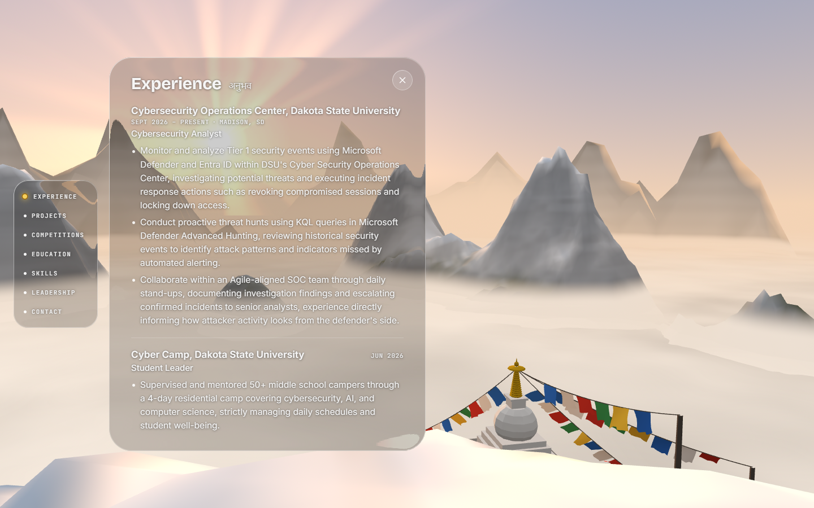

# Portfolio

The personal site of Evan Bhandari, Cyber Operations student at Dakota State University and
analyst in the DSU Cybersecurity Operations Center. It is a scroll-driven climb up a misty
mountain: a foggy valley, through a cloud layer, to a summit above a sea of clouds. The
résumé is at the top, in a rail of seven sections that open as glass panels over the view.



**Live site:** [evanbhandari.com.np](https://evanbhandari.com.np)

The scene is one continuous procedural world; only the camera and the atmosphere change with
scroll. There are no model, texture, HDRI or image files: terrain, sky, clouds, grass, trees,
prayer flags and chortens are all generated in code, and every random choice is seeded, so
every load builds the same mountain.

Worth a look if you read code:

- **One frame loop.** A single `requestAnimationFrame` loop in `src/scroll/ScrollRig.tsx`
  drives Lenis, the scroll state, the copy's fades and the WebGL render (a
  `frameloop="never"` canvas). React re-renders only when something structural changes.
- **Fog that thins with altitude.** `src/scene/fog.ts` patches three.js's `fog_vertex` chunk
  once at startup, so every fogged material gets height-aware fog with no new uniform.
- **Placement that rejects instead of approximating.** A tree, post or flag that would stand
  on the trail, pass behind the copy or reach into the cloud band is dropped and reported
  (`npm run audit:plan`).
- **Liquid glass.** In Chromium the summit panels bend the scene across their rim with an
  SVG displacement map through `backdrop-filter` (`src/summit/liquidGlass.ts`).
- **Fallbacks.** Reduced motion, no WebGL, a lower quality tier for phones, and a frame-time
  guard that steps detail down on slow machines.
- **Measured, not eyeballed.** `tools/ui-audit/` drives Chrome over the DevTools Protocol, with
  no npm dependencies, for screenshots, contrast, keyboard reachability and frame time.

## Tech stack

| Package | Version | Role |
| --- | --- | --- |
| React | ~19.2 | UI. Held below 19.3, the top of @react-three/fiber 9.7's peer range |
| TypeScript | ~6.0 | Strict mode |
| Vite | ^8.3 | Dev server and build |
| Tailwind CSS | ^4.3 | Styling, through `@tailwindcss/vite` |
| three | ~0.182 | WebGL. Pinned: @react-three/fiber 9.7 constructs `THREE.Clock`, which logs a deprecation warning from 0.183 |
| @react-three/fiber | ^9.7 | React renderer for three.js (no drei) |
| Lenis | ^1.3 | Smooth scrolling |
| oxlint | ^1.81 | Lint |

## Run it locally

Needs Node 20.19+ or 22.12+ (Vite 8). The audit tools also need Node 22+ and Chrome.

```bash
npm ci
npm run dev        # http://localhost:5173
npm run build      # typecheck + production build into dist/
npm run preview    # serve the production build
npm run lint
npm run typecheck
```

The dev server reads one environment variable, `PORT`, and holds it strictly (a taken port
fails rather than moving). Without it Vite uses 5173 or the next free port. The site itself
reads no environment variables.

Every push to `main` runs `.github/workflows/deploy.yml`, which lints, builds and publishes
`dist/` to GitHub Pages at the custom domain set in the repository's Pages settings.

## Project structure

```
.github/workflows/       deploy.yml: lint, build and publish to GitHub Pages on push to main
index.html               entry HTML: title, description, font preloads
public/fonts/            the self-hosted webfonts and their license (OFL.txt)
src/main.tsx             entry: pushes config colours into CSS, mounts the app
src/App.tsx              the three layers: WebGL canvas, scroller, summit rail
src/content/             the copy: content.ts (one entry per climb beat) and resume.ts
                         (the résumé the summit rail and panels both render)
src/hero/                Hero (track + pinned stage), Beat
src/scroll/              ScrollRig (Lenis + the frame loop), scrollStore, progress math,
                         ticker, navigation
src/scene/config.ts      every tunable: track length, easing, camera path, terrain,
                         atmosphere schedule, clouds, mist, palette
src/scene/               SceneRoot (Canvas, a lazily loaded chunk), SceneDirector (camera),
                         terrain/Terrain, Sky, Clouds, Mist, Grass, Rocks, SnowPlume,
                         LightShafts, wind, atmosphere, fog (aerial perspective), cameraPath,
                         grassPlan, noise, cloudTexture, BeatCrossfade (reduced motion),
                         SceneBoundary (falls back to the no-WebGL poster on error)
src/scene/nepal/         the Nepal detail layer: prayer flags, chortens, the stone trail,
                         rhododendrons, conifers and shrubs. plan.ts, floraPlan.ts and
                         trailPlan.ts place them, flags.ts switches each feature, config.ts
                         tunes them
src/summit/              SummitNav (rail, panels, hash, focus), SectionBody (a section's
                         layout), liquidGlass (the refraction filter), summit.css, layout
                         (the summit frame's zones and the rail's reveal window)
src/ui/                  DebugHud, NepalHudSection (the HUD's Nepal switches), NepalAccents
src/lib/                 quality (one tier for the scene), perfGuard (frame-time watchdog),
                         env (URL flags, device and motion detection), debug, math
src/world/scale.ts       one unit (STEP) and every prop's size as a ratio of it
tools/ui-audit/          the measurement harness (see its README)
docs/screenshot.png      the image at the top of this file
```

## Debug flags

| URL / key | Effect |
| --- | --- |
| `?debug=1` or the `D` key | Debug HUD: progress, t, beat, camera, clearance, fog, frameloop, FPS, DPR, triangles, draw calls, switches for each Nepal-layer feature, and buttons that scroll to each beat's exact center |
| `?reduced=1` | Force reduced-motion mode (same as the OS setting) |
| `?nogl=1` | Force the no-WebGL fallback (gradient poster, beats as ordinary sections) |
| `?q=low` / `?q=high` | Force the quality tier instead of detecting the device |
| `?perf=off` | Pin the frame-time guard at full detail (screenshot runs need this) |
| `?nepal=0` | Start with every Nepal-layer feature off, for before/after comparisons |
| `?nepal-density=full` / `half` | Force the Nepal layer's instance density |
| `?glass=frosted` | Turn the summit glass's refraction off, leaving the CSS-only clear glass Firefox and Safari get |
| `?glass=opaque` | Near-opaque dark panels instead of clear glass |
| `#experience`, `#skills`... | Open the page at the summit with that section's panel open (any id in `resume.ts`) |

In dev builds `window.__hero` exposes the scroll store, layout, Lenis handle and scene stats.

`src/scene/nepal/devProbe.ts` holds console-only helpers from the Nepal layer's placement
work (screen projection, frame hashing, GPU timing). Nothing imports it, so it never reaches
the build. Load it from the dev server's console with
`await import('/src/scene/nepal/devProbe.ts')`. Some helpers, such as `pillContrast`, target
markup that no longer exists.

## How it works

- `#scroll-root` (fixed, `overflow-y: auto`) is the only scrolling element; `html` and `body`
  never scroll. The WebGL canvas sits fixed behind it in `#gl`.
- One Lenis instance and one `requestAnimationFrame` loop live in `src/scroll/ScrollRig.tsx`.
  Each tick: `lenis.raf`, then the scroll store (p, t, beat), then frame callbacks in order:
  beat styles and the summit rail's fade, the WebGL render (`advance()` on a
  `frameloop="never"` Canvas), the HUD. React re-renders only when the beat changes, when the
  rail crosses into view, or when a panel opens.
- `p` is hero progress; `t = p + K sin(2 pi N p) / (2 pi N)` slows travel around each beat's
  center. Camera, fog, sky, sun and text are pure functions of t (see `src/scroll/progress.ts`).
- The hero is the whole page. The climb runs for `HERO_SCREENS - 1` screens, over which `t`
  goes 0 to 1, and the page ends there, with the camera parked at the summit. There is no
  section below and no top bar.
- The resume lives at the summit (see Summit below): a rail of seven section names fades in
  as the camera crests, and each opens a glass panel over the scene. Both are fixed above the
  scroller, so opening one never moves the page or the camera.

## Scale

`src/world/scale.ts` fixes one unit for the whole world - `STEP`, the across-path width of a
trail slab - and states every prop as a ratio of it: a roadside chorten is 3 steps tall, a
rhododendron 4, a prayer flag a seventeenth of its pole. Sizes are derived from those ratios,
never written by hand, and dev-time assertions check each ratio against its band and the size
ladder for ordering. `BIAS` scales the landmarks as a set for readability at this camera
distance without changing their proportions to each other.

Placement rules live with the props (`nepal/floraPlan.ts`, `nepal/plan.ts`) and reject rather
than approximate: a tree that would stand on the trail, on a pole, under a flag string, too
near the camera's route, or through the cloud base is dropped and reported. `npm run audit:plan`
prints what was placed and what was rejected, with the reason.

Two of those rules are sweeps rather than spot checks. `behindCopy` (`nepal/anchors.ts`)
projects a prop's whole outline across every scroll position where a beat's copy is on
screen, at four frame shapes, against that copy's measured footprint: no tree, post, cord
or flag may pass behind the words. It is why nothing grows on the left of the route - below
the valley rim everything on the left drifts down through the bottom-left corner as the
camera closes in. `checkClearOfCloudBand` keeps every flag and post out of the cloud band,
where the materials tint toward cloud and dissolve anything above the base.

## Type

Four self-hosted families, all defined in `src/index.css`: the families are tokens in
`@theme`, the roles are the type scale. Components name a role class and never a font
utility, so a family or size change is one edit there.

| Role | Face | Used for |
| --- | --- | --- |
| `t-display` | Bricolage Grotesque 800, 96pt optical size, 44-64px | the H1 |
| `t-h2` | Bricolage Grotesque 700, 36pt optical size, 28-40px | every other headline |
| `t-lead` | Fraunces italic 500, 18-20px | the one-line greeting above the H1 |
| `t-body` | Inter 400, 16-17px | the paragraph under a headline |
| `t-label` | Inter 500, 14-15px | the reference lists and the contact links |

Headlines are sentence case in the copy itself (`content.ts`).

The files in `public/fonts/` are Google Fonts' own latin and latin-ext subsets, from the css2
API (each `@font-face` notes its query), under the SIL Open Font License 1.1. Inter is the
variable file because the page uses three of its weights; the others are static instances of
about 22 kB. Inter and the H1's Bricolage are preloaded in `index.html`.

Each family has a local fallback face rescaled to it, so the swap does not reflow the copy.
`size-adjust` is measured on this page's own copy in Chrome (webfont against the local face),
and the ascent and descent overrides are the webfont's metrics divided by that factor.
Re-measure if a font or the copy changes much. The paragraph's width is `max-w-measure`
(22.75rem, the width it had in monospace) rather than a `ch` value, which would differ between
the fallback and the webfont.

The summit rail and panels set the same four families at their own sizes in
`src/summit/summit.css`: Bricolage for a panel's title, Inter for its text, JetBrains Mono (the
page's only monospace) for the rail labels, dates and badges.

## Summit

The page ends on the parked summit view. `src/summit/SummitNav.tsx` puts the resume there:

- **Rail.** Seven buttons down the left edge (a pill bar along the bottom below 900px), in
  the order of `RESUME` in `src/content/resume.ts`. It fades in over `RAIL_REVEAL`
  (`summit/layout.ts`), is hidden and inert on the climb, and closes any open panel if the
  visitor scrolls back down the mountain.
- **Panels.** One per section, all mounted, only the open one visible. Opening one moves
  focus into it and sets the URL hash; Esc, the close button, the active rail item or a press
  outside closes it and puts focus back on its rail item. Loading the page with a section's
  hash goes straight to the summit with that panel open. Below 900px the panel is a sheet
  above the bar.
- **Content.** Everything the rail and panels show comes from `RESUME`. Edit a section there
  and nowhere else. The wording is the resume's, verbatim.
- **Glass.** The rail and panels are clear glass, matched to reference images: no blur, so
  the scene sits sharp behind them, and a 20% dark tint (chosen by eye with a test slider).
  What makes them glass is the rim: in Chromium `summit/liquidGlass.ts` bends the scene
  inward across a curved edge with an SVG displacement map through `backdrop-filter: url()`,
  and a 1px bright hairline (brightest top left) traces the shape. No drop shadow. Type is
  white with a soft dark halo (`--glass-text-shadow`); the tint is what lets it read against
  the sun. Every value is a `--glass-*` token at the top of `summit.css`; surfaces use
  `.glass`, and things set on the glass (close button, chips, badges) use `.glass-inset`, a
  pale fill. Firefox and Safari get the same glass without the bend (`?glass=frosted` shows
  it in Chrome). Under reduced motion a panel fades in place instead of springing out.

`prefers-reduced-transparency` changes nothing: Windows reports it whenever Settings >
Personalization > Colors > Transparency effects is off, and this glass has no blur to
reduce. `?glass=opaque` is there for anyone who wants the text on a solid panel.

## Measuring

`tools/ui-audit/` drives the installed Chrome over the DevTools Protocol, with no npm
dependencies. It expects the dev server on port 5174 and Chrome at its standard Windows
path; see `tools/ui-audit/README.md`. Its output goes to `docs/ui-audit/`, which is not
committed.

| Command | What it checks |
| --- | --- |
| `npm run audit:shots` | Screenshots at a fixed list of scroll offsets, per viewport |
| `npm run audit:contrast` | Every element that paints text clears WCAG AA, on the climb, on the rail and in each open panel, and the frame never loses all contrast. `--transparency reduce` matches a machine with Windows transparency effects off; `--url "http://localhost:5174/?glass=frosted"` measures the Firefox and Safari glass |
| `npm run audit:keyboard` | Nothing focusable on the climb; at the summit Tab walks the rail, Enter opens a panel and moves focus in, its links are reachable, arrow keys scroll the panel not the page, Esc closes and returns focus |
| `npm run audit:plan` | What the Nepal layer placed and what it rejected, with the reason |
| `npm run audit:cost` | Frame time by material group, so density work can be aimed at what is expensive |
| `npm run audit:perf` | Throughput with vsync off and a per-frame GPU sync |
| `npm run audit:ab` | Interleaved A/B of one render-state change, immune to machine drift |
| `npm run audit:summit` | Where the chorten, its flags and the sun land on screen at the parked camera, how much of the chorten the snow hides, and any peg standing alone |
| `npm run audit:copyzone` | Re-measures where each climb beat's copy sits per frame shape; paste its output over `COPY_ZONES` after any type change |

Three things the harness learned the hard way, all documented in the files: frame time in a
browser is vsync-capped so it measures "kept up", not headroom; headless Chrome reports a
coarse pointer at desktop widths, which silently puts the scene on the phone tier unless the
capture pins `?q=high`; and it inherits `prefers-reduced-transparency` from the OS, so a
capture of the summit glass has to pin that media feature or it photographs the fallback.

## Tuning

Prop sizes come from `src/world/scale.ts`. Everything else lives in `src/scene/config.ts`.
The ones worth reaching for first:

| What | Where | Now |
| --- | --- | --- |
| Grass blades (high tier) | `GRASS.COUNT` | 96000 |
| ...on the low tier | `GRASS.LOW_SCALE` | 0.35 |
| How far grass is drawn | `GRASS.DRAW_DISTANCE` | 74 |
| Where grass drops to a one-segment blade | `GRASS.LOD_DISTANCE` | 19 |
| Grass patchiness | `GRASS.PATCH_DEPTH` / `PATCH_SCALE` | 0.55 / 17 |
| Wind strength and gusts | `WIND_BASE`, `WIND_GUST`, `WIND_SPEED` | 1, 0.75, 1.6 |
| Wind direction | `WIND_DIR` | [-0.22, -1] |
| Snow line | `TERRAIN_BANDS.snow` | [42, 55] |
| Snow on steep faces | `TERRAIN_BANDS.snowSlope` | [0.26, 0.58] |
| Fog density per beat | `ATMOSPHERE[].density` | 0.0075 in the valley, 0.035 inside the cloud layer, 0.0025 at the summit |
| How fast fog thins with height | `FOG_SCALE_HEIGHT` | 26 |
| Rock relief and its reach | `ROCK_RELIEF`, `ROCK_RELIEF_FADE` | 0.85, [90, 260] |
| Terrain resolution | `TERRAIN_SEGMENTS_DESKTOP` / `_MOBILE` | 224 / 128 |
| Horizon ranges | `FAR_RANGES` | 2 bands |
| Boulder count | `ROCKS.COUNT` | 1500 |
| When the summit rail fades in | `RAIL_REVEAL` (summit/layout.ts) | t 0.94 -> 0.99 |
| Glass rim width and bend | `PANEL_GLASS`, `RAIL_GLASS` (summit/SummitNav.tsx) | panel 38px / 40px, rail 22px / 22px |
| Glass tint | `--glass-tint` (summit/summit.css) | black 20% |
| Glass edge | `--glass-border-start` / `-mid` / `-end` (summit/summit.css) | white 0.7 / 0.3 / 0.45 |
| Text on the glass | `--glass-text`, `--glass-text-shadow` (summit/summit.css) | white, 2px / 4px dark halo |
| Peak silhouettes | `DISTANT_PEAKS[].sharpness` / `stretch` / `twist` | per peak |
| Light rays | `SHAFTS.WINDOWS` | two t windows |
| Spindrift | `PLUME.OPACITY`, `PLUME.LENGTH` | 0.85, 150 |

Quality: `?q=low` forces the phone build (fewer blades, coarser terrain, DPR 1.25) on a
desktop, `?q=high` forces the full one anywhere. On top of that, `src/lib/perfGuard.ts`
watches frame times and pulls grass in, then drops the light shafts, if the machine cannot
hold ~40fps - it only ever steps down, and only after a sustained run of slow frames.

## Notes

- `three` is pinned to ~0.182 because @react-three/fiber 9.7 constructs `THREE.Clock`, which
  logs a deprecation warning from three 0.183. `react` stays below 19.3 for the same package.
- `src/scene/fog.ts` replaces three's `fog_vertex` shader chunk once, at startup, so
  `vFogDepth` carries optical depth instead of view depth: fog thins with altitude, which is
  what separates a hazy valley from the crisp ridge above it. It applies to every fogged
  material in the scene, including ones that patch `fog_fragment` themselves, and needs no
  new uniform or attribute: it reads world height back out of `mvPosition` and the view
  matrix, which every stock vertex shader that includes `fog_vertex` has.
- Light rig: a hemisphere light plus two directional lights - the sun, and a soft fill from
  the sun's side of the sky (`SKY_FILL_SHARE` of the schedule's hemisphere intensity). Real
  skylight is far brighter around the sun than opposite it, and that difference is what gives
  a backlit slope its form.
- Terrain shading adds two things on top of Lambert: per-fragment rock mottling (the mesh is
  too coarse to carry detail as geometry) and baked sky occlusion, which darkens gullies and
  leaves ridges open. Both are tuned in `config.ts` (`ROCK_MOTTLE`, `AO_*`).

## Credits

**Fonts.** Self-hosted subsets from Google Fonts, all under the SIL Open Font License 1.1.
The copyright lines below are read from the font files themselves; the full license is in
`public/fonts/OFL.txt`.

| Family | Copyright |
| --- | --- |
| [Inter](https://github.com/rsms/inter) | 2016 The Inter Project Authors |
| [Bricolage Grotesque](https://github.com/ateliertriay/bricolage) | 2022 The Bricolage Grotesque Project Authors |
| [Fraunces](https://github.com/undercasetype/Fraunces) | 2020 The Fraunces Project Authors |
| [JetBrains Mono](https://github.com/JetBrains/JetBrainsMono) | 2020 The JetBrains Mono Project Authors |

**Code and drawings from elsewhere.** Where these came from was not recorded when they were
added, so the licenses below are not verified.

- The close icon in `src/summit/SummitNav.tsx` has the same path as the `x` icon from
  [Lucide](https://lucide.dev) (ISC License).
- The simplex noise in `src/scene/noise.ts` follows Stefan Gustavson's reference
  implementation.
- The `mulberry32` random number generator in `src/scene/noise.ts` is Tommy Ettinger's.

**Libraries.** React, three.js, @react-three/fiber and Lenis, all MIT licensed, installed
from npm and not copied into this repository.

## License

- **Code:** MIT. See [LICENSE](LICENSE).
- **Content:** the résumé and copy in `src/content/`, the same wording where it repeats (the
  page title and description in `index.html`, this README's introduction), and
  `docs/screenshot.png` are © 2026 Evan Bhandari, all rights reserved. They are not covered
  by the MIT License.
- **Fonts:** SIL Open Font License 1.1. See [public/fonts/OFL.txt](public/fonts/OFL.txt).
